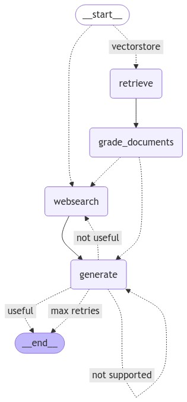

# README

## Overview
This project implements a **Retrieval-Augmented Generation (RAG) pipeline** using **LangChain** and **Ollama's LLaMA 3.1 model**. The system retrieves relevant documents from a **vector store** (built from web articles) and uses an **LLM** to generate responses based on these documents. If relevant documents are not found, the system performs a **web search** to enhance its responses.

## Features
- **LLM-based Question Answering**: Uses a local **LLaMA 3.1 (8B)** model via **LangChain Ollama**.
- **Document Retrieval**: Retrieves documents from a **SKLearn vector store** using **NomicEmbeddings**.
- **Web Search**: Uses **Tavily Search** when vector store retrieval is insufficient.
- **Automated Grading**: Filters retrieved documents based on relevance and detects hallucinations in generated responses.
- **Graph-Based Workflow**: Implements decision-making using **LangGraph** to determine whether to rely on RAG or web search.

## Installation
1. Clone the repository:
   ```bash
   git clone <repo-url>
   cd <repo-folder>
   ```
2. Install dependencies:
   ```bash
   pip install -r requirements.txt
   ```
3. Set up environment variables:
   - Create a `.env` file and add your API keys:
     ```env
     TAVILY_API_KEY=<your_api_key>
     ```
   - Load them in Python using `dotenv`.

## Usage
### 1. Load LLM Model
The system initializes an **Ollama LLaMA 3.1** model:
```python
local_llm = "llama3.1:8b"
llm = ChatOllama(model=local_llm, temperature=0)
llm_json_mode = ChatOllama(model=local_llm, temperature=0, format="json")
```

### 2. Initialize Vector Store
Documents are fetched from predefined URLs and indexed into a **SKLearn-based vector store**:
```python
docs = [WebBaseLoader(url).load() for url in urls]
text_splitter = RecursiveCharacterTextSplitter.from_tiktoken_encoder(chunk_size=1000, chunk_overlap=200)
doc_splits = text_splitter.split_documents(docs_list)
vectorstore = SKLearnVectorStore.from_documents(doc_splits, embedding=NomicEmbeddings(model="nomic-embed-text-v1.5", inference_mode="local"))
retriever = vectorstore.as_retriever(k=3)
```

### 3. Define Workflow
The **LangGraph** workflow decides between document retrieval and web search.

#### Nodes:
- **retrieve()**: Fetches relevant documents from the vector store.
- **generate()**: Generates a response based on retrieved documents.
- **grade_documents()**: Evaluates document relevance.
- **web_search()**: Runs a web search if retrieved documents are insufficient.

#### Decision Points:
- If retrieved documents are **not relevant**, switch to web search.
- If the **generated response contains hallucinations**, retry generation or fetch new data.
- The workflow stops if a satisfactory answer is produced.

### 4. Run the Workflow
To execute the retrieval and generation process:
```python
graph = workflow.compile()
question = "What are advanced LLM adversarial attacks?"
result = graph.invoke({"question": question})
print(result)
```

## Output
- The system generates an answer based on retrieved documents.
- If needed, it performs a web search to improve accuracy.
- A final answer is returned after ensuring it is well-grounded and relevant.

## Visualization
A **graph representation** of the workflow:



## Future Improvements
- Expand the dataset with more diverse sources.
- Improve document grading using fine-tuned classification models.
- Optimize the LLM model for better inference speed.


